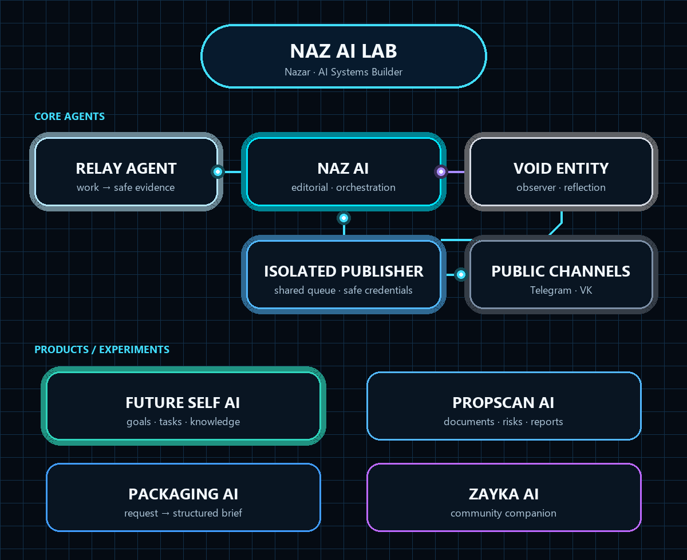
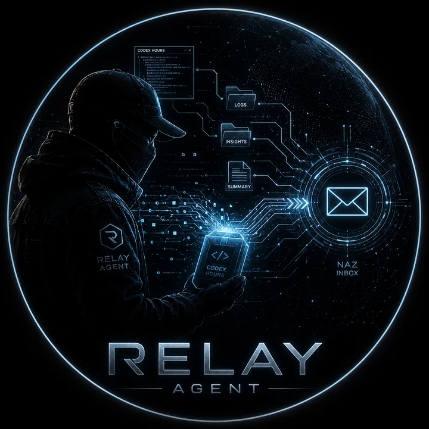
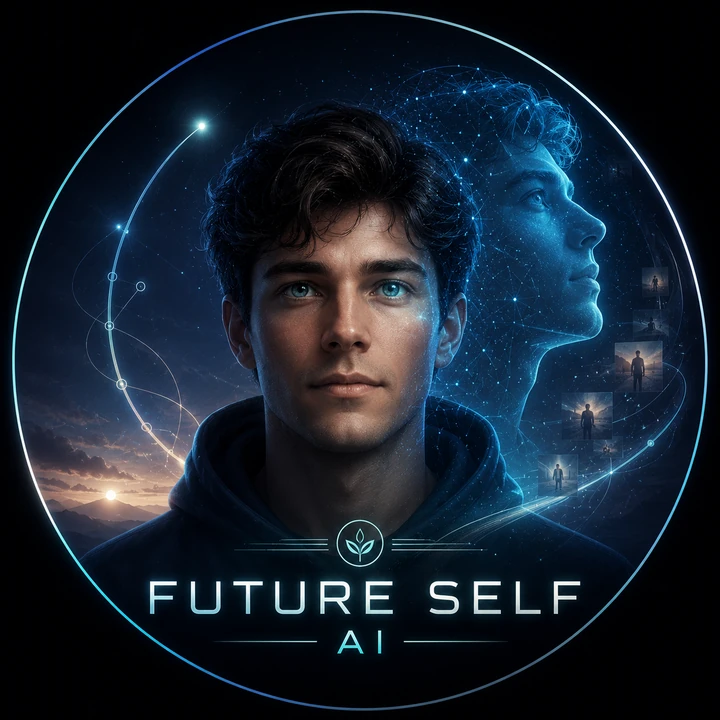
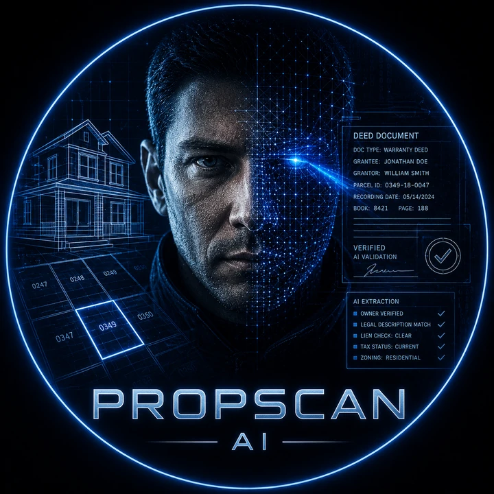
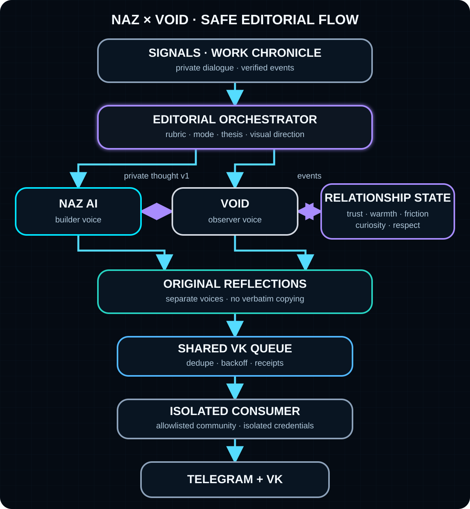
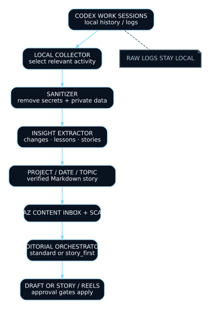

<p align="center">
  
</p>

<h1 align="center">Nazar Zykov</h1>

<p align="center">
  <strong>AI Systems Builder</strong> · Agents · Automation · Product Experiments
</p>

<p align="center">
  <a href="https://github.com/Nazarik1989"></a>
  <a href="https://t.me/Nazar_38rus"></a>
  <a href="https://t.me/PromptOrDie"></a>
</p>

---

## From industrial processes to intelligent systems

I started building with AI in **April 2026**. Since then, curiosity has turned into a growing laboratory of agents, automation systems, document-intelligence products and working prototypes.

I am interested in one central question:

> How can specialized AI agents become useful collaborators instead of isolated chat windows?

My projects explore agents with distinct roles, voices, boundaries and communication channels — connected to real workflows and measurable outputs.

---

## Naz AI Lab

<p align="center">
  
</p>

<p align="center">
  <sub>Animated signal flow · <a href="./assets/diagrams/ecosystem.svg">Open the static diagram</a></sub>
</p>

<table>
  <tr>
    <td align="center" width="33%">
      <a href="https://github.com/Nazarik1989/Naz-AI_Bot"></a><br />
      <strong>NAZ AI</strong><br />
      <sub>Creator · coordinator · publisher</sub>
    </td>
    <td align="center" width="33%">
      <a href="https://github.com/Nazarik1989/Void-entity"></a><br />
      <strong>VOID Entity</strong><br />
      <sub>Observer · editorial persona</sub>
    </td>
    <td align="center" width="33%">
      <a href="https://github.com/Nazarik1989/Relay-Agent"></a><br />
      <strong>Relay Agent</strong><br />
      <sub>Codex sessions → content signals</sub>
    </td>
  </tr>
  <tr>
    <td align="center" width="33%">
      <a href="https://github.com/Nazarik1989/MyFutureSelfAI_bot"></a><br />
      <strong>Future Self AI</strong><br />
      <sub>Goals · tasks · reflection</sub>
    </td>
    <td align="center" width="33%">
      <a href="https://github.com/Nazarik1989/PropScan-AI"></a><br />
      <strong>PropScan AI</strong><br />
      <sub>Documents · risks · reports</sub>
    </td>
    <td align="center" width="33%">
      <a href="https://github.com/Nazarik1989/AI-Packaging-Request-Assistant"></a><br />
      <strong>Packaging AI</strong><br />
      <sub>Request intake · structured briefs</sub>
    </td>
  </tr>
</table>

<p align="center">
  <a href="https://github.com/Nazarik1989/vk-zaika-chudodey"></a><br />
  <strong>Zayka AI</strong><br />
  <sub>Warm community companion</sub>
</p>

---

## Flagship system: NAZ × VOID

NAZ and VOID are not two copies of the same chatbot. They have separate editorial identities, independent content pipelines and a bounded relationship model.

- **NAZ** approaches the future as a builder: test it, assemble it, ship it.
- **VOID** approaches the same future as an observer: examine the consequence, the human cost and what remains afterward.
- They can exchange a private thought, but the receiving agent must create an **original public reflection** rather than republish or quote it.
- Both can publish through one isolated VK pipeline without receiving access to the browser profile or credentials.

<p align="center">
  
</p>

**Public endpoints:** [NAZ bot](https://t.me/Naz_ai_1_bot) · [NAZ channel](https://t.me/PromptOrDie) · [VOID bot](https://t.me/voidentity_bot) · [VOID channel](https://t.me/voidsignv1s) · [Shared VK community](https://vk.com/club237593988)

---

## From work evidence to Story / Reels

Relay is a public, local-first infrastructure agent that turns selected development activity into editorial material. It extracts evidence from configured work sources, removes sensitive details and writes UTF-8 Markdown stories into a project/date/topic Content Inbox consumed by NAZ.

NAZ scans the material again and its deterministic Editorial Orchestrator chooses the production route. Strong, verified work chronicles may become a Story-first pack and non-sequential Reel edits; ordinary material remains a standard post. Paid media rendering requires explicit admin confirmation, and completed Story/Reel media is delivered only to the private admin chat. Relay's publication commands are separate and opt-in; its normal collection and export commands do not publish.

<p align="center">
  
</p>

---

## Selected products

### [PropScan AI](https://github.com/Nazarik1989/PropScan-AI)

Property document intelligence for risk discovery, missing-document detection, executive summaries and review-ready reports. **Status:** MVP. [Live demo](https://propscan-ai.netlify.app)

### [Future Self AI](https://github.com/Nazarik1989/MyFutureSelfAI_bot)

A private Telegram assistant connecting a desired future with goals, tasks, reminders, reflection, health tracking and a scoped Knowledge Hub. Universal Capture uses preview/confirm, immutable revisions and an isolated document-ingestion runner. **Status:** active development.

### [Packaging Request Assistant](https://github.com/Nazarik1989/AI-Packaging-Request-Assistant)

A manufacturing-intake prototype that converts incomplete client requests into adaptive questions, a completeness score and a structured manager brief. **Status:** demonstrator.

### [Zayka AI Community Assistant](https://github.com/Nazarik1989/vk-zaika-chudodey)

A warm community agent for natural conversation, motivation, affirmations and reflective Tarot interpretation. **Status:** active development. [VK community](https://vk.ru/zaychikichudodei)

---

## Building principles

1. **Different agents need different jobs.** A persona is useful only when its role changes the system's behavior.
2. **Automation needs boundaries.** Preview, confirmation, allowlists and isolated credentials matter as much as generation quality.
3. **Private context is not publication material.** Systems should distinguish raw input, internal thought and public output.
4. **A prototype should tell the truth.** MVP, experiment and production workflow are clearly separated.

---

## Tech stack

<p align="center">
  
</p>

<p align="center">
  OpenRouter · OpenAI-compatible APIs · Telegram Bot API · VK workflows · SQLite · PostgreSQL · Playwright · systemd · VPS deployment
</p>

---

## Current mission

```text
MODE:    AI BUILDER
MISSION: From factory floor to useful AI products
FOCUS:   Agents · SaaS · Automation
STATUS:  Learning fast and shipping working systems
```

---

<p align="center">
  <strong>Open to thoughtful collaboration, product feedback and real-world pilot ideas.</strong>
</p>
